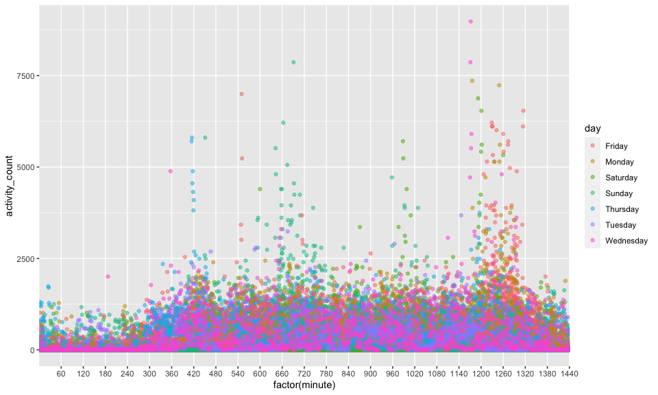

p8105\_hw3\_at3535
================
Amanda Tsai
10/10/2020

``` r
library(tidyverse)
```

    ## ── Attaching packages ─────────────────────────────────── tidyverse 1.3.0 ──

    ## ✓ ggplot2 3.3.2     ✓ purrr   0.3.4
    ## ✓ tibble  3.0.3     ✓ dplyr   1.0.2
    ## ✓ tidyr   1.1.2     ✓ stringr 1.4.0
    ## ✓ readr   1.3.1     ✓ forcats 0.5.0

    ## ── Conflicts ────────────────────────────────────── tidyverse_conflicts() ──
    ## x dplyr::filter() masks stats::filter()
    ## x dplyr::lag()    masks stats::lag()

``` r
library(p8105.datasets)
data("instacart")
knitr::opts_chunk$set(
  fig.width = 10,
  fig.asp = .6,
  out.width = "90%"
)
```

# Problem 1

# Problem 2

The following code chunk loads the accelerometer dataset and cleans the
dataset by encoding with reasonable variable classes, adds a new
variable week\_weekend that determines whether the day observed is a
weekday or weekend, and combines all activity observations into one
variable column.

``` r
accel_df = 
  read_csv(file = "./data/accel_data.csv") %>%
  janitor::clean_names() %>%
  mutate(day = as.factor(day)) %>%
  mutate(week_weekend = as.factor(ifelse(day %in% c("Saturday", "Sunday"), "weekend", "weekday"))) %>%
  pivot_longer(activity_1:activity_1440,
               names_to = "minute",
               names_prefix = "activity_",
               values_to = "activity_count") %>%
  mutate(
    minute = as.integer(minute),
    week = as.factor(week), 
    day_id = as.factor(day_id)) 
```

    ## Parsed with column specification:
    ## cols(
    ##   .default = col_double(),
    ##   day = col_character()
    ## )

    ## See spec(...) for full column specifications.

``` r
accel_df
```

    ## # A tibble: 50,400 x 6
    ##    week  day_id day    week_weekend minute activity_count
    ##    <fct> <fct>  <fct>  <fct>         <int>          <dbl>
    ##  1 1     1      Friday weekday           1           88.4
    ##  2 1     1      Friday weekday           2           82.2
    ##  3 1     1      Friday weekday           3           64.4
    ##  4 1     1      Friday weekday           4           70.0
    ##  5 1     1      Friday weekday           5           75.0
    ##  6 1     1      Friday weekday           6           66.3
    ##  7 1     1      Friday weekday           7           53.8
    ##  8 1     1      Friday weekday           8           47.8
    ##  9 1     1      Friday weekday           9           55.5
    ## 10 1     1      Friday weekday          10           43.0
    ## # … with 50,390 more rows

``` r
skimr::skim(accel_df)
```

|                                                  |           |
| :----------------------------------------------- | :-------- |
| Name                                             | accel\_df |
| Number of rows                                   | 50400     |
| Number of columns                                | 6         |
| \_\_\_\_\_\_\_\_\_\_\_\_\_\_\_\_\_\_\_\_\_\_\_   |           |
| Column type frequency:                           |           |
| factor                                           | 4         |
| numeric                                          | 2         |
| \_\_\_\_\_\_\_\_\_\_\_\_\_\_\_\_\_\_\_\_\_\_\_\_ |           |
| Group variables                                  | None      |

Data summary

**Variable type: factor**

| skim\_variable | n\_missing | complete\_rate | ordered | n\_unique | top\_counts                                |
| :------------- | ---------: | -------------: | :------ | --------: | :----------------------------------------- |
| week           |          0 |              1 | FALSE   |         5 | 1: 10080, 2: 10080, 3: 10080, 4: 10080     |
| day\_id        |          0 |              1 | FALSE   |        35 | 1: 1440, 2: 1440, 3: 1440, 4: 1440         |
| day            |          0 |              1 | FALSE   |         7 | Fri: 7200, Mon: 7200, Sat: 7200, Sun: 7200 |
| week\_weekend  |          0 |              1 | FALSE   |         2 | wee: 36000, wee: 14400                     |

**Variable type: numeric**

| skim\_variable  | n\_missing | complete\_rate |   mean |     sd | p0 |    p25 |   p50 |     p75 | p100 | hist  |
| :-------------- | ---------: | -------------: | -----: | -----: | -: | -----: | ----: | ------: | ---: | :---- |
| minute          |          0 |              1 | 720.50 | 415.70 |  1 | 360.75 | 720.5 | 1080.25 | 1440 | ▇▇▇▇▇ |
| activity\_count |          0 |              1 | 267.04 | 443.16 |  1 |   1.00 |  74.0 |  364.00 | 8982 | ▇▁▁▁▁ |

The resulting dataset has the existing variables: **week, day\_id, day,
week\_weekend, minute, activity\_count** which respectively are of
types: **factor, factor, factor, factor, integer, numeric**.

The dimensions of the dataset are 50400 x 6, meaning that there are a
total of 50400 observations for 6 different variables. There are 35
unique entries for the day\_id variable, showing that the dataset
contains observations over a span of 35 days.

The key variables in this dataset are **day, minute** and
**activity\_count**.

``` r
total_activity = 
  accel_df %>% 
  group_by(day_id) %>%
  summarize(daily_activity = sum(activity_count))
```

    ## `summarise()` ungrouping output (override with `.groups` argument)

``` r
total_activity
```

    ## # A tibble: 35 x 2
    ##    day_id daily_activity
    ##    <fct>           <dbl>
    ##  1 1             480543.
    ##  2 2              78828.
    ##  3 3             376254 
    ##  4 4             631105 
    ##  5 5             355924.
    ##  6 6             307094.
    ##  7 7             340115.
    ##  8 8             568839 
    ##  9 9             295431 
    ## 10 10            607175 
    ## # … with 25 more rows

``` r
skimr::skim(total_activity)
```

|                                                  |                 |
| :----------------------------------------------- | :-------------- |
| Name                                             | total\_activity |
| Number of rows                                   | 35              |
| Number of columns                                | 2               |
| \_\_\_\_\_\_\_\_\_\_\_\_\_\_\_\_\_\_\_\_\_\_\_   |                 |
| Column type frequency:                           |                 |
| factor                                           | 1               |
| numeric                                          | 1               |
| \_\_\_\_\_\_\_\_\_\_\_\_\_\_\_\_\_\_\_\_\_\_\_\_ |                 |
| Group variables                                  | None            |

Data summary

**Variable type: factor**

| skim\_variable | n\_missing | complete\_rate | ordered | n\_unique | top\_counts            |
| :------------- | ---------: | -------------: | :------ | --------: | :--------------------- |
| day\_id        |          0 |              1 | FALSE   |        35 | 1: 1, 2: 1, 3: 1, 4: 1 |

**Variable type: numeric**

| skim\_variable  | n\_missing | complete\_rate |     mean |       sd |   p0 |      p25 |    p50 |      p75 |   p100 | hist  |
| :-------------- | ---------: | -------------: | -------: | -------: | ---: | -------: | -----: | -------: | -----: | :---- |
| daily\_activity |          0 |              1 | 384543.5 | 163481.7 | 1440 | 329841.5 | 389080 | 468144.5 | 685910 | ▂▂▇▆▃ |

The trends are not quite clear.

``` r
accel_df %>%
  ggplot(aes(x = factor(minute), y = activity_count)) +
  geom_point(alpha = 0.5, aes(color = day)) +
  scale_x_discrete(breaks = seq(from = 0, to = 1440, by = 60), 
                   labels = seq(from = 0, to = 1440, by = 60) ) +
  geom_smooth(se = FALSE)
```

    ## `geom_smooth()` using method = 'loess' and formula 'y ~ x'



# Problem 3

``` r
data("ny_noaa")
```
