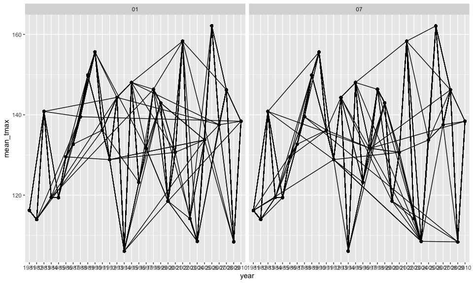

p8105\_hw3\_at3535
================
Amanda Tsai
10/10/2020

``` r
library(tidyverse)
```

    ## ── Attaching packages ─────────────────────────────────── tidyverse 1.3.0 ──

    ## ✓ ggplot2 3.3.2     ✓ purrr   0.3.4
    ## ✓ tibble  3.0.3     ✓ dplyr   1.0.2
    ## ✓ tidyr   1.1.2     ✓ stringr 1.4.0
    ## ✓ readr   1.3.1     ✓ forcats 0.5.0

    ## ── Conflicts ────────────────────────────────────── tidyverse_conflicts() ──
    ## x dplyr::filter() masks stats::filter()
    ## x dplyr::lag()    masks stats::lag()

``` r
library(p8105.datasets)
data("instacart")
knitr::opts_chunk$set(
  fig.width = 10,
  fig.asp = .6,
  out.width = "90%"
)
```

# Problem 1

This dataset contains 1384617 rows and 15 columns.

Observations are the level of items in order by user. There are
user/order variables – User ID, order ID, order day, and order hour.
There are also item variables – name, department, aisle, and some
numeric codes.

``` r
# instacart %>% 
#   count(aisle) %>%
#   arrange(decs(n))
```

``` r
# instacart %>% 
#   count(aisle) %>%
#   filter(n > 10000) %>%
#   mutate(
#     aisle = factor(aisle),
#     aisle = fct_reorder(aisle, n)
#   ) %>%
#   ggplot(aes(x = aisle, y = n)) +
#   geom_point() +
#   theme(axis.text.x = element_text(angle = 90, vjust = 0.5, hjust = 1))
```

# Problem 2

The following code chunk loads the accelerometer dataset and cleans the
dataset by encoding with reasonable variable classes, adds a new
variable week\_weekend that determines whether the day observed is a
weekday or weekend, and combines all activity observations into one
variable column.

``` r
accel_df =
  read_csv(file = "./data/accel_data.csv") %>%
  janitor::clean_names() %>%
  mutate(day = as.factor(day)) %>%
  mutate(week_weekend = as.factor(ifelse(day %in% c("Saturday", "Sunday"), "weekend", "weekday"))) %>%
  pivot_longer(activity_1:activity_1440,
               names_to = "minute",
               names_prefix = "activity_",
               values_to = "activity_count") %>%
  mutate(
    minute = as.integer(minute),
    week = as.factor(week),
    day_id = as.factor(day_id))
```

    ## Parsed with column specification:
    ## cols(
    ##   .default = col_double(),
    ##   day = col_character()
    ## )

    ## See spec(...) for full column specifications.

``` r
accel_df
```

    ## # A tibble: 50,400 x 6
    ##    week  day_id day    week_weekend minute activity_count
    ##    <fct> <fct>  <fct>  <fct>         <int>          <dbl>
    ##  1 1     1      Friday weekday           1           88.4
    ##  2 1     1      Friday weekday           2           82.2
    ##  3 1     1      Friday weekday           3           64.4
    ##  4 1     1      Friday weekday           4           70.0
    ##  5 1     1      Friday weekday           5           75.0
    ##  6 1     1      Friday weekday           6           66.3
    ##  7 1     1      Friday weekday           7           53.8
    ##  8 1     1      Friday weekday           8           47.8
    ##  9 1     1      Friday weekday           9           55.5
    ## 10 1     1      Friday weekday          10           43.0
    ## # … with 50,390 more rows

``` r
skimr::skim(accel_df)
```

|                                                  |           |
| :----------------------------------------------- | :-------- |
| Name                                             | accel\_df |
| Number of rows                                   | 50400     |
| Number of columns                                | 6         |
| \_\_\_\_\_\_\_\_\_\_\_\_\_\_\_\_\_\_\_\_\_\_\_   |           |
| Column type frequency:                           |           |
| factor                                           | 4         |
| numeric                                          | 2         |
| \_\_\_\_\_\_\_\_\_\_\_\_\_\_\_\_\_\_\_\_\_\_\_\_ |           |
| Group variables                                  | None      |

Data summary

**Variable type: factor**

| skim\_variable | n\_missing | complete\_rate | ordered | n\_unique | top\_counts                                |
| :------------- | ---------: | -------------: | :------ | --------: | :----------------------------------------- |
| week           |          0 |              1 | FALSE   |         5 | 1: 10080, 2: 10080, 3: 10080, 4: 10080     |
| day\_id        |          0 |              1 | FALSE   |        35 | 1: 1440, 2: 1440, 3: 1440, 4: 1440         |
| day            |          0 |              1 | FALSE   |         7 | Fri: 7200, Mon: 7200, Sat: 7200, Sun: 7200 |
| week\_weekend  |          0 |              1 | FALSE   |         2 | wee: 36000, wee: 14400                     |

**Variable type: numeric**

| skim\_variable  | n\_missing | complete\_rate |   mean |     sd | p0 |    p25 |   p50 |     p75 | p100 | hist  |
| :-------------- | ---------: | -------------: | -----: | -----: | -: | -----: | ----: | ------: | ---: | :---- |
| minute          |          0 |              1 | 720.50 | 415.70 |  1 | 360.75 | 720.5 | 1080.25 | 1440 | ▇▇▇▇▇ |
| activity\_count |          0 |              1 | 267.04 | 443.16 |  1 |   1.00 |  74.0 |  364.00 | 8982 | ▇▁▁▁▁ |

The resulting dataset has the existing variables: **week, day\_id, day,
week\_weekend, minute, activity\_count** which respectively are of
types: **factor, factor, factor, factor, integer, numeric**.

The dimensions of the dataset are 50400 x 6, meaning that there are a
total of 50400 observations for 6 different variables. There are 35
unique entries for the day\_id variable, showing that the dataset
contains observations over a span of 35 days.

The key variables in this dataset are **day, minute** and
**activity\_count**.

``` r
total_activity =
  accel_df %>%
  group_by(day_id) %>%
  summarize(daily_activity = sum(activity_count))
```

    ## `summarise()` ungrouping output (override with `.groups` argument)

``` r
total_activity
```

    ## # A tibble: 35 x 2
    ##    day_id daily_activity
    ##    <fct>           <dbl>
    ##  1 1             480543.
    ##  2 2              78828.
    ##  3 3             376254 
    ##  4 4             631105 
    ##  5 5             355924.
    ##  6 6             307094.
    ##  7 7             340115.
    ##  8 8             568839 
    ##  9 9             295431 
    ## 10 10            607175 
    ## # … with 25 more rows

``` r
skimr::skim(total_activity)
```

|                                                  |                 |
| :----------------------------------------------- | :-------------- |
| Name                                             | total\_activity |
| Number of rows                                   | 35              |
| Number of columns                                | 2               |
| \_\_\_\_\_\_\_\_\_\_\_\_\_\_\_\_\_\_\_\_\_\_\_   |                 |
| Column type frequency:                           |                 |
| factor                                           | 1               |
| numeric                                          | 1               |
| \_\_\_\_\_\_\_\_\_\_\_\_\_\_\_\_\_\_\_\_\_\_\_\_ |                 |
| Group variables                                  | None            |

Data summary

**Variable type: factor**

| skim\_variable | n\_missing | complete\_rate | ordered | n\_unique | top\_counts            |
| :------------- | ---------: | -------------: | :------ | --------: | :--------------------- |
| day\_id        |          0 |              1 | FALSE   |        35 | 1: 1, 2: 1, 3: 1, 4: 1 |

**Variable type: numeric**

| skim\_variable  | n\_missing | complete\_rate |     mean |       sd |   p0 |      p25 |    p50 |      p75 |   p100 | hist  |
| :-------------- | ---------: | -------------: | -------: | -------: | ---: | -------: | -----: | -------: | -----: | :---- |
| daily\_activity |          0 |              1 | 384543.5 | 163481.7 | 1440 | 329841.5 | 389080 | 468144.5 | 685910 | ▂▂▇▆▃ |

The trends are not quite clear.

``` r
# accel_df %>%
#   ggplot(aes(x = factor(minute), y = activity_count)) +
#   geom_point(alpha = 0.5, aes(color = day)) +
#   scale_x_discrete(breaks = seq(from = 0, to = 1440, by = 60),
#                    labels = seq(from = 0, to = 1440, by = 60) ) +
#   geom_smooth(se = FALSE)
# 
```

# Problem 3

``` r
data("ny_noaa")
skimr::skim(ny_noaa)
```

|                                                  |          |
| :----------------------------------------------- | :------- |
| Name                                             | ny\_noaa |
| Number of rows                                   | 2595176  |
| Number of columns                                | 7        |
| \_\_\_\_\_\_\_\_\_\_\_\_\_\_\_\_\_\_\_\_\_\_\_   |          |
| Column type frequency:                           |          |
| character                                        | 3        |
| Date                                             | 1        |
| numeric                                          | 3        |
| \_\_\_\_\_\_\_\_\_\_\_\_\_\_\_\_\_\_\_\_\_\_\_\_ |          |
| Group variables                                  | None     |

Data summary

**Variable type: character**

| skim\_variable | n\_missing | complete\_rate | min | max | empty | n\_unique | whitespace |
| :------------- | ---------: | -------------: | --: | --: | ----: | --------: | ---------: |
| id             |          0 |           1.00 |  11 |  11 |     0 |       747 |          0 |
| tmax           |    1134358 |           0.56 |   1 |   4 |     0 |       532 |          0 |
| tmin           |    1134420 |           0.56 |   1 |   4 |     0 |       548 |          0 |

**Variable type: Date**

| skim\_variable | n\_missing | complete\_rate | min        | max        | median     | n\_unique |
| :------------- | ---------: | -------------: | :--------- | :--------- | :--------- | --------: |
| date           |          0 |              1 | 1981-01-01 | 2010-12-31 | 1997-01-21 |     10957 |

**Variable type: numeric**

| skim\_variable | n\_missing | complete\_rate |  mean |     sd |   p0 | p25 | p50 | p75 |  p100 | hist  |
| :------------- | ---------: | -------------: | ----: | -----: | ---: | --: | --: | --: | ----: | :---- |
| prcp           |     145838 |           0.94 | 29.82 |  78.18 |    0 |   0 |   0 |  23 | 22860 | ▇▁▁▁▁ |
| snow           |     381221 |           0.85 |  4.99 |  27.22 | \-13 |   0 |   0 |   0 | 10160 | ▇▁▁▁▁ |
| snwd           |     591786 |           0.77 | 37.31 | 113.54 |    0 |   0 |   0 |   0 |  9195 | ▇▁▁▁▁ |

This dataset contains 2595176 rows and 7 columns.

Observations are the amount of snowfall, snow depth, precipitation,
maximum and minimum temperatures each day for all New York state weather
stations from January 1, 1981 through December 31, 2010. Key variables
are those 5 core variables observed mentioned above: prcp, snow, snwd,
tmax, and tmin.

The completion rates for variables tmax and tmin are both 0.56, meaning
almost half of the observations do not include this data. The accuracy
in trends shown by the data for this variables will be greatly affected.
For the other 3 core variables, the completion rate for precipitation is
0.94 and for snowfall it is 0.85. The trends plotted from these
variables will have relatively more accuracy. However, for snow depth,
the completion rate is 0.77, meaning that there is still quite a lot of
missing data for this variable so the reliability of results inferred
from this variable data will be compromised.

``` r
ny_noaa = 
  ny_noaa %>% 
  separate(date, into = c("year", "month", "day")) %>%
  mutate(tmax  = as.numeric(tmax), tmin = as.numeric(tmin), prcp = as.double(prcp), snow = as.double(snow), snwd = as.double(snwd))

ny_noaa
```

    ## # A tibble: 2,595,176 x 9
    ##    id          year  month day    prcp  snow  snwd  tmax  tmin
    ##    <chr>       <chr> <chr> <chr> <dbl> <dbl> <dbl> <dbl> <dbl>
    ##  1 US1NYAB0001 2007  11    01       NA    NA    NA    NA    NA
    ##  2 US1NYAB0001 2007  11    02       NA    NA    NA    NA    NA
    ##  3 US1NYAB0001 2007  11    03       NA    NA    NA    NA    NA
    ##  4 US1NYAB0001 2007  11    04       NA    NA    NA    NA    NA
    ##  5 US1NYAB0001 2007  11    05       NA    NA    NA    NA    NA
    ##  6 US1NYAB0001 2007  11    06       NA    NA    NA    NA    NA
    ##  7 US1NYAB0001 2007  11    07       NA    NA    NA    NA    NA
    ##  8 US1NYAB0001 2007  11    08       NA    NA    NA    NA    NA
    ##  9 US1NYAB0001 2007  11    09       NA    NA    NA    NA    NA
    ## 10 US1NYAB0001 2007  11    10       NA    NA    NA    NA    NA
    ## # … with 2,595,166 more rows

The most commonly observed value for snowfall is 0

``` r
ny_noaa %>%
  filter(month == "01" | month == "07") %>%
  group_by(year) %>%
  mutate(
    mean_tmax = mean(tmax, na.rm = TRUE)
  ) %>%
  ggplot(aes(x = year, y = mean_tmax, group = id)) +
  geom_point() + 
  geom_path()
```



``` r
  facet_grid(.~month)
```

    ## <ggproto object: Class FacetGrid, Facet, gg>
    ##     compute_layout: function
    ##     draw_back: function
    ##     draw_front: function
    ##     draw_labels: function
    ##     draw_panels: function
    ##     finish_data: function
    ##     init_scales: function
    ##     map_data: function
    ##     params: list
    ##     setup_data: function
    ##     setup_params: function
    ##     shrink: TRUE
    ##     train_scales: function
    ##     vars: function
    ##     super:  <ggproto object: Class FacetGrid, Facet, gg>

\`
